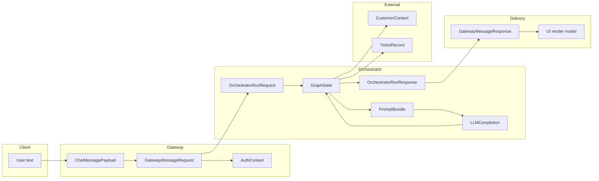
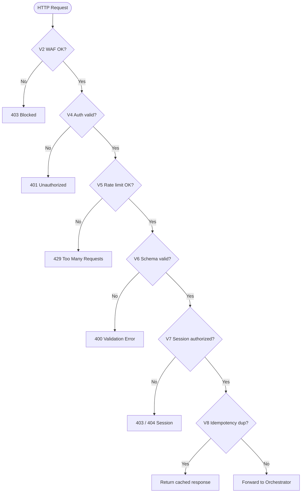
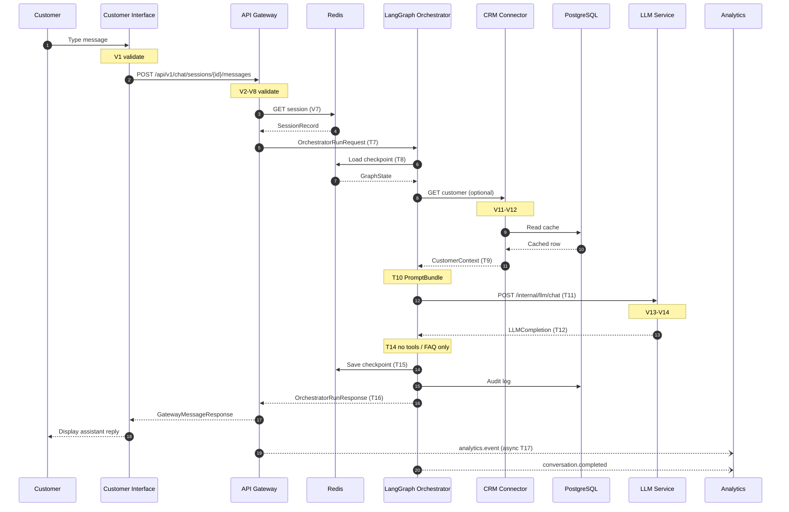
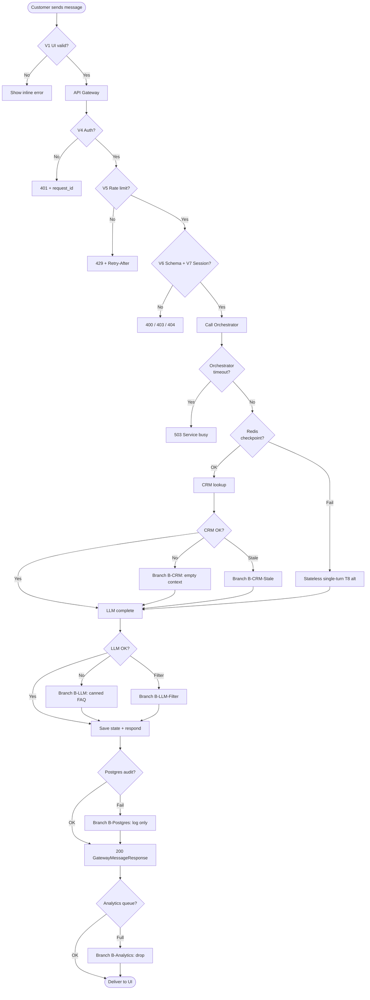
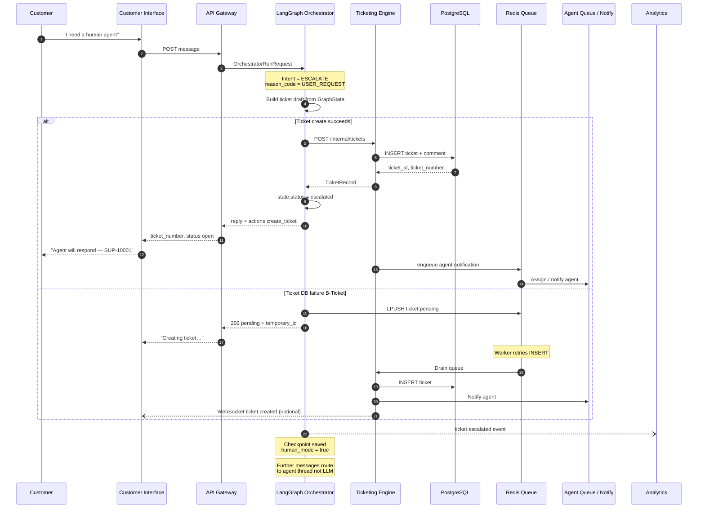
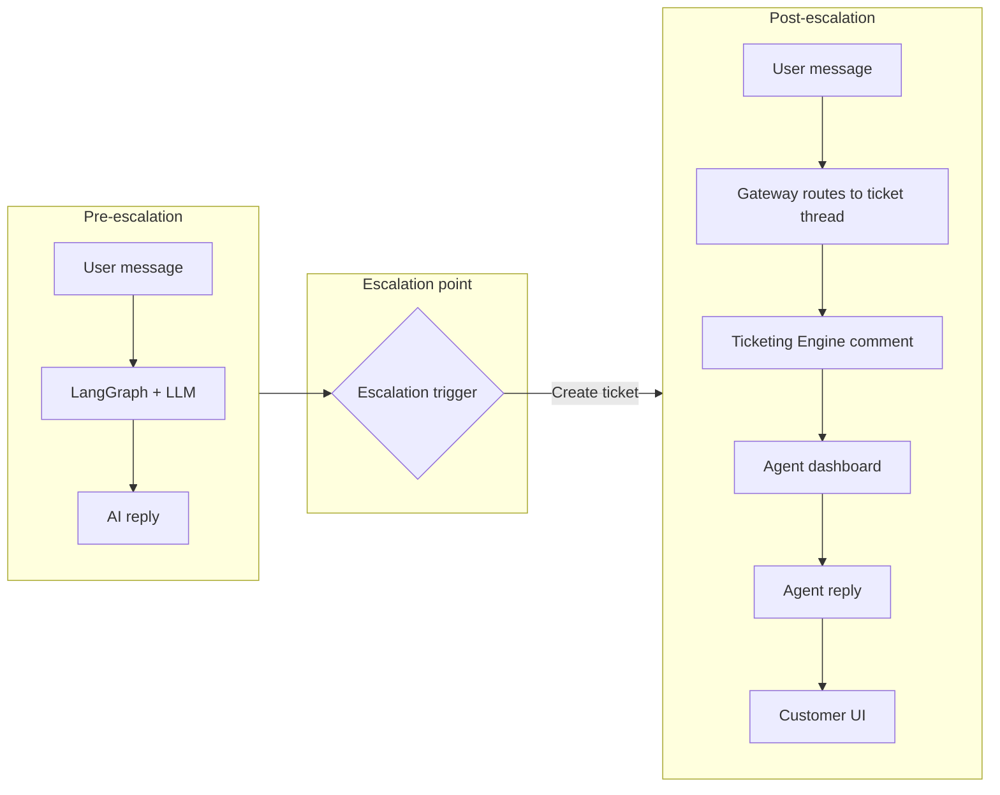

# Epic 1.1 — Complete Data Flow Specification

**User Story 1.1.2** · AI Customer Support System  
**Prerequisite:** [EPIC_1.1_SYSTEM_ARCHITECTURE.md](./EPIC_1.1_SYSTEM_ARCHITECTURE.md)  
**Stack:** Python · FastAPI · LangGraph · Redis · PostgreSQL  
**Status:** Design artifact (no application code required for this story)

---

## 1. Purpose

This document shows **how data moves** from a customer typing a message through validation, orchestration, optional CRM/ticket/LLM calls, and back to the UI. It complements the component blueprint (Story 1.1.1) with:

- End-to-end flow mapping
- Transformation points (shape changes)
- Validation checkpoints
- Error branches per path
- **Three dedicated diagrams:** happy path, error scenarios, escalation flows

---

## 2. End-to-end data flow (customer message → response delivery)

### 2.1 Flow overview (narrative)

| Step | Location | Data in | Data out |
|------|----------|---------|----------|
| 1 | **Customer Interface** | User keystrokes | `ChatMessagePayload` (JSON over HTTPS/WSS) |
| 2 | **API Gateway** | Raw HTTP body | Validated `GatewayMessageRequest` + `request_id`, `session_id` |
| 3 | **API Gateway** | JWT / API key | `AuthContext` (customer_id, roles, scopes) |
| 4 | **API Gateway → Redis** | Session lookup | `SessionRecord` or create new session |
| 5 | **API Gateway → Orchestrator** | Enriched request | `OrchestratorRunRequest` |
| 6 | **LangGraph Orchestrator** | Run request | Load/create `GraphState` from Redis checkpoint |
| 7 | **Orchestrator → CRM** (optional) | `crm_external_id` | `CustomerContext` (normalized) |
| 8 | **Orchestrator** | Messages + context | `PromptBundle` (system + history + tools) |
| 9 | **Orchestrator → LLM** | `PromptBundle` | `LLMCompletion` (tokens, tool_calls) |
| 10 | **Orchestrator** (tools) | Tool decision | Ticket ID / FAQ answer / handoff flag |
| 11 | **Orchestrator → Redis/Postgres** | Updated state | Persisted checkpoint + audit row |
| 12 | **Orchestrator → Gateway** | `OrchestratorRunResponse` | `reply`, `actions`, `status` |
| 13 | **API Gateway** | Internal response | `GatewayMessageResponse` (public schema) |
| 14 | **Gateway → Analytics** (async) | Event envelope | Queued — no blocking |
| 15 | **Customer Interface** | JSON / WS frames | Rendered assistant message + UI actions |

### 2.2 Data artifact lineage (single message)



---

## 3. Data transformation points

Every hop that **changes structure, encoding, or semantics** is a transformation point. Implementers must log `request_id` across these boundaries.

| ID | Transformation point | Input shape | Output shape | Transformation rules |
|----|----------------------|-------------|--------------|----------------------|
| **T1** | UI → Transport | DOM / form state | `ChatMessagePayload` | Trim whitespace; max 4k chars; strip script tags; attach `session_id` |
| **T2** | TLS / Load balancer | HTTP bytes | Decrypted HTTP | Terminate TLS; add `X-Forwarded-For`, `X-Request-ID` |
| **T3** | Gateway body parse | JSON bytes | Python dict | JSON parse; charset UTF-8 |
| **T4** | Gateway validation | dict | `GatewayMessageRequest` | Pydantic: required `content`, optional `attachments` |
| **T5** | Auth middleware | Headers + token | `AuthContext` | JWT verify; map `sub` → `customer_id` |
| **T6** | Session resolver | `session_id` + `AuthContext` | `SessionRecord` | Redis GET or INSERT; bind session to customer |
| **T7** | Gateway → Orchestrator map | `GatewayMessageRequest` + context | `OrchestratorRunRequest` | Add `customer_context`, `config`, correlation IDs |
| **T8** | Checkpoint load | `session_id` | `GraphState` | Deserialize LangGraph state from Redis; merge new user message |
| **T9** | CRM normalize | CRM vendor JSON | `CustomerContext` | Field mapping; mask sensitive fields; set `cached_at` |
| **T10** | Prompt assembly | `GraphState` + `CustomerContext` | `PromptBundle` | Token budget trim; inject system policy; RAG chunks |
| **T11** | LLM provider map | `PromptBundle` | Provider API JSON | Model-specific schema; stream flag |
| **T12** | LLM response parse | Provider stream/chunks | `LLMCompletion` | Aggregate tokens; extract `tool_calls`; run output filter |
| **T13** | Tool execution | `tool_calls[]` | `ToolResults` | Map to ticket create / CRM read / KB search |
| **T14** | State reduction | `GraphState` + `ToolResults` | Updated `GraphState` | Graph node routing; set `status`, `reply` |
| **T15** | Checkpoint save | `GraphState` | Redis blob + Postgres audit | Serialize; TTL 30d; append audit event |
| **T16** | Orchestrator → Gateway map | `OrchestratorRunResponse` | `GatewayMessageResponse` | Strip internal fields; map `actions` for UI |
| **T17** | Analytics envelope | Multiple internal objects | `AnalyticsEvent` | PII classification; async fire-and-forget |
| **T18** | UI render | `GatewayMessageResponse` | React state | Markdown safe render; action buttons |

### 3.1 Transformation detail: prompt assembly (T10)

```
GraphState.messages[]     ──┐
CustomerContext (CRM)     ──┼──► PromptBuilder ──► PromptBundle
RAG retrieval chunks      ──┤         │
Policy / safety system    ──┘         ├── token count ≤ max_context
                                      ├── redact PAN/SSN patterns
                                      └── tool definitions JSON schema
```

### 3.2 Transformation detail: tool results → reply (T13–T14)

| Tool name | Input | Output merged into state |
|-----------|-------|--------------------------|
| `crm_lookup` | `crm_external_id` | `state.customer_context` |
| `create_ticket` | subject, description | `state.ticket_id`, `actions[]` |
| `search_kb` | query embedding | `state.rag_citations[]` |
| `escalate_human` | reason code | `state.status = escalated` |

---

## 4. Data validation checkpoints

Validation occurs at **boundaries** (trust decreases crossing each boundary). Failures stop forward progress unless noted as async/side-path.

| Checkpoint | Location | What is validated | On failure |
|------------|----------|-------------------|------------|
| **V1** | Customer Interface | Non-empty message; max length; allowed attachment MIME | Block send; inline error |
| **V2** | WAF / Edge | Request size ≤ 1 MB; SQLi/XSS patterns | `403` / connection drop |
| **V3** | API Gateway — TLS | Valid certificate chain | Connection refused |
| **V4** | API Gateway — Auth | Valid JWT/API key; not expired; correct audience | `401 Unauthorized` |
| **V5** | API Gateway — Rate limit | Requests/min per IP + per customer_id | `429` + `Retry-After` |
| **V6** | API Gateway — Schema | `GatewayMessageRequest` Pydantic validation | `400` + field errors |
| **V7** | API Gateway — Session | `session_id` exists and belongs to `customer_id` | `403` or `404` |
| **V8** | API Gateway — Idempotency | Duplicate `Idempotency-Key` within 24h | Return cached `202` response |
| **V9** | Orchestrator — Run input | `OrchestratorRunRequest` schema; `session_id` match | `400` to gateway → `502` public |
| **V10** | Orchestrator — State integrity | Checkpoint version compatible | New session branch or `503` |
| **V11** | CRM Connector — ID format | `crm_external_id` regex / length | Skip CRM; proceed without context |
| **V12** | CRM Connector — Response | Required fields present after map | Use stale cache or empty context |
| **V13** | LLM Service — Input | Token count ≤ limit; no blocked content | `400` → orchestrator retry/fallback |
| **V14** | LLM Service — Output | Content policy; JSON tool schema if tools | Regenerate once; else safe fallback |
| **V15** | Ticketing — Create | Subject length; priority enum; customer link | `400` → orchestrator explains to user |
| **V16** | Gateway — Response map | Public schema before exit | `500` logged; generic error to client |
| **V17** | Analytics — Event | `event_type` enum; `pii_level` set | Drop event; metric increment |

### 4.1 Validation decision tree (gateway ingress)



---

## 5. Error handling paths (per data flow branch)

### 5.1 Branch catalog

| Branch ID | Trigger | Data path after failure | User-visible outcome |
|-----------|---------|-------------------------|----------------------|
| **B-Auth** | V4 fails | Stop at gateway | “Please sign in again” |
| **B-Rate** | V5 fails | Stop at gateway | “Too many requests, wait N seconds” |
| **B-Validate** | V6–V7 fail | Stop at gateway | Field-level or session error |
| **B-Orch-Down** | Orchestrator timeout/503 | Gateway circuit breaker | “Service busy, try again” |
| **B-CRM** | CRM timeout/5xx | Orchestrator continues without context | AI reply without personalization |
| **B-CRM-Stale** | Cache expired, live fail | Use stale `CustomerContext` + internal flag | Reply + optional “profile may be outdated” |
| **B-LLM** | Provider error/timeout | Orchestrator fallback node | Canned FAQ + “create ticket?” action |
| **B-LLM-Filter** | Content policy block | Safe template response | Neutral message; no harmful content |
| **B-Ticket** | Ticketing DB error | Redis queue + `202` pending | “Ticket is being created…” |
| **B-Redis** | Checkpoint unavailable | Stateless single-turn mode | Reply without multi-turn memory |
| **B-Postgres** | Audit write fail | Log locally; continue | User still gets reply; ops alert |
| **B-Analytics** | Queue full | Drop/sample event | No user impact |

### 5.2 Error propagation rules

1. **Never leak internal errors** — map to `error.code` from architecture doc §4.7.
2. **Always attach `request_id`** — generated at V2/V4; returned in error JSON.
3. **Retry only idempotent reads** — CRM GET, checkpoint GET; never blind retry ticket POST.
4. **Orchestrator owns compensation** — gateway does not call LLM directly on retry.

---

## 6. Diagram A — Happy path (full success)

Customer sends message → AI resolves without escalation or errors.



**Happy path data summary**

| Stage | Key fields persisted |
|-------|---------------------|
| Redis | `checkpoint:{session_id}`, `session:{session_id}` |
| Postgres | `conversations.audit`, optional `crm_cache` hit |
| Not created | No ticket row; `status = completed` |

---

## 7. Diagram B — Error scenarios

Covers validation failures, dependency outages, and degraded modes.



### 7.1 Error scenario reference table

| Scenario | Checkpoints hit | HTTP / status | Data retained |
|----------|-----------------|---------------|---------------|
| Invalid JSON body | V6 | 400 | None |
| Expired session token | V4 | 401 | None |
| Wrong session owner | V7 | 403 | None |
| Orchestrator 30s timeout | B-Orch-Down | 503 | Partial checkpoint if saved |
| CRM API down | V12, B-CRM | 200 (degraded) | Last cache in Postgres |
| LLM provider 5xx | V13, B-LLM | 200 (fallback text) | User message in checkpoint |
| Output content filter | V14, B-LLM-Filter | 200 (safe template) | Flag in audit |
| Redis down | B-Redis | 200 (no memory) | No checkpoint |
| Ticket DB down (if tool fired) | B-Ticket | 202 pending | Redis queue `ticket:pending` |

---

## 8. Diagram C — Escalation flows

Escalation = human agent involvement via **ticket creation**, **queue assignment**, or **live handoff**.

### 8.1 Escalation triggers

| Trigger | Detected by | `reason_code` |
|---------|-------------|---------------|
| User asks for human | Intent node in graph | `USER_REQUEST` |
| Low AI confidence | `confidence < 0.6` | `LOW_CONFIDENCE` |
| Repeated failed resolution | 3+ `unable_to_help` in session | `REPEAT_FAILURE` |
| Sensitive topic policy | Policy classifier | `POLICY_ESCALATION` |
| LLM suggests tool `escalate_human` | Tool call | `MODEL_ESCALATION` |
| SLA breach on existing ticket | Ticketing worker | `SLA_BREACH` |

### 8.2 Escalation flow diagram



### 8.3 Post-escalation data flow



| Field | Pre-escalation | Post-escalation |
|-------|----------------|-----------------|
| `GraphState.human_mode` | `false` | `true` |
| Message handler | LangGraph → LLM | Ticketing comments API |
| `session.primary_route` | `ai` | `ticket:{ticket_id}` |
| Analytics `event_type` | `chat.message` | `ticket.comment` |

---

## 9. Consolidated data dictionary (cross-boundary)

| Artifact | Owner | Storage | TTL |
|----------|-------|---------|-----|
| `ChatMessagePayload` | UI | Transient | — |
| `GatewayMessageRequest` | Gateway | Transient | — |
| `AuthContext` | Gateway | Redis session | 24h |
| `SessionRecord` | Gateway | Redis | 24h |
| `OrchestratorRunRequest` | Orchestrator | Transient | — |
| `GraphState` | Orchestrator | Redis checkpoint | 30d |
| `CustomerContext` | CRM Connector | Postgres cache | 24h |
| `PromptBundle` | Orchestrator | Transient | — |
| `LLMCompletion` | LLM Service | Transient (7d logs opt-in) | 7d |
| `TicketRecord` | Ticketing | Postgres | 7y |
| `GatewayMessageResponse` | Gateway | Transient | — |
| `AnalyticsEvent` | Analytics | Postgres + queue | 13mo raw |

---

## 10. Mapping to implementation (future epics)

When coding begins, implement validation at:

| Checkpoint | Suggested location |
|------------|-------------------|
| V4–V8 | `backend/app/api/` middleware + Pydantic schemas |
| V9–V14 | `backend/app/orchestrator/` (future) |
| V15 | `backend/app/ticketing/` (future) |
| T8, T15 | LangGraph + Redis client in `services/` |

**Story 1.1.2 does not require code** — this document is the deliverable.

---

## 11. Acceptance checklist (Story 1.1.2)

| Task | Section | Done |
|------|---------|------|
| End-to-end flow mapped | §2 | ✅ |
| Transformation points identified | §3 | ✅ |
| Validation checkpoints documented | §4 | ✅ |
| Error paths per branch | §5, §7 | ✅ |
| Happy path diagram | §6 | ✅ |
| Error scenarios diagram | §7 | ✅ |
| Escalation flows diagram | §8 | ✅ |

---

*Document version: 1.0 · Epic 1.1 · User Story 1.1.2*
