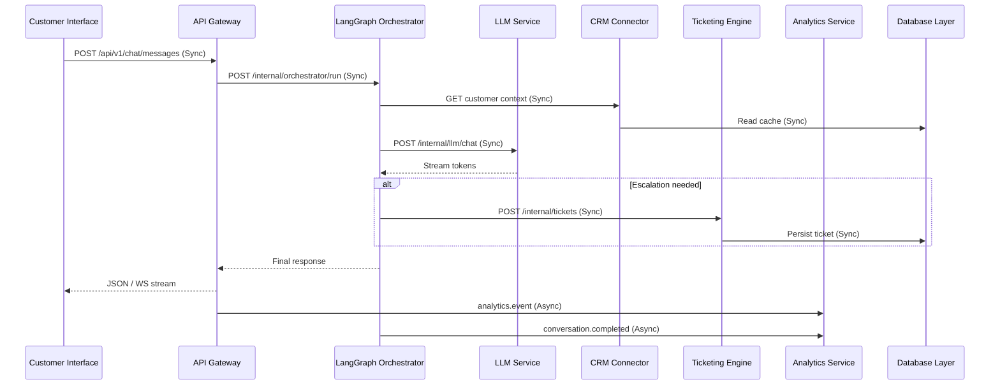

# Epic 1.1 — System Architecture Blueprint

**User Story 1.1.1** · AI Customer Support System  
**Stack:** Python · FastAPI · LangGraph · Redis · PostgreSQL  
**Status:** Architecture definition (no application feature code required for this story)

---

## 1. Executive summary

This document is the development blueprint for an AI-powered customer support platform. It defines **8 core services**, how they communicate, API contracts, deployment topology, failure handling, scalability targets, and data retention. Implementation of business features begins in later epics; this epic produces **design artifacts only**.

---

## 2. Component specification — 8 core services

| # | Service | Responsibility | Primary tech | Data stores |
|---|---------|----------------|--------------|-------------|
| 1 | **Customer Interface** | Web/mobile chat UI, ticket status, knowledge search, session UX | React/Next.js (or SPA) | Browser session; calls API Gateway only |
| 2 | **API Gateway** | AuthN/AuthZ, rate limiting, routing, request validation, TLS termination edge | FastAPI (+ reverse proxy: Nginx/Traefik) | Redis (sessions, rate limits) |
| 3 | **LangGraph Orchestrator** | Conversation state machine, tool routing, human handoff, workflow checkpoints | Python · LangGraph | Redis (state/checkpoints); Postgres (audit) |
| 4 | **LLM Service** | Prompt assembly, model invocation, streaming tokens, safety filters | Python · provider SDK (OpenAI/Azure/etc.) | Redis (prompt cache); no PII long-term store |
| 5 | **CRM Connector** | Sync customer profile, orders, account tier with external CRM (Salesforce/HubSpot) | Python · REST adapters | Postgres (sync cache); CRM is system of record |
| 6 | **Ticketing Engine** | Create/update/assign/close tickets, SLA timers, agent queue | FastAPI service module | Postgres (tickets, comments) |
| 7 | **Analytics Service** | Events, dashboards, CSAT, resolution time, AI deflection metrics | Python · batch/stream jobs | Postgres (aggregates); optional warehouse later |
| 8 | **Database Layer** | Persistence, migrations, backups, read replicas | PostgreSQL 16 · SQLAlchemy/Alembic | Postgres primary + replicas; Redis for cache/queue |

### 2.1 Service descriptions

#### 1. Customer Interface

- **Purpose:** End-user entry point for support conversations and self-service.
- **Exposes:** HTTPS to users only (no direct DB access).
- **Depends on:** API Gateway (REST/WebSocket).
- **Out of scope for v1:** Direct calls to LangGraph, LLM, or Postgres.

#### 2. API Gateway

- **Purpose:** Single northbound API for all clients; enforces security and quotas.
- **Exposes:** `/api/v1/*` REST, optional `/ws/v1/chat` WebSocket.
- **Depends on:** LangGraph Orchestrator, Ticketing Engine, CRM Connector (read), Analytics (async events).
- **Implementation note:** Can start as monolithic FastAPI app with modular routers; split to dedicated gateway service when scale demands.

#### 3. LangGraph Orchestrator

- **Purpose:** AI conversation brain — intent detection, RAG retrieval, tool calls (create ticket, fetch CRM), escalation to human.
- **Exposes:** Internal gRPC/HTTP (not public internet).
- **Depends on:** LLM Service, Ticketing Engine, CRM Connector, Redis, Postgres.
- **Key flows:** `chat.start` → graph nodes → `llm.complete` / `ticket.create` / `crm.lookup`.

#### 4. LLM Service

- **Purpose:** Isolated model access layer for swapability, cost control, and observability.
- **Exposes:** Internal `POST /internal/llm/chat`, `POST /internal/llm/embed`.
- **Depends on:** External LLM provider API.
- **Constraints:** Timeouts, token budgets, content moderation before/after generation.

#### 5. CRM Connector

- **Purpose:** Normalize customer context from external CRM for personalized support.
- **Exposes:** Internal `GET /internal/crm/customers/{id}`, `GET /internal/crm/customers/{id}/orders`.
- **Depends on:** CRM vendor API; Postgres cache.
- **Sync pattern:** Read-through cache; async webhook/poll for updates.

#### 6. Ticketing Engine

- **Purpose:** System of record for support cases when AI cannot resolve or user requests agent.
- **Exposes:** Internal + gateway-proxied `POST/GET/PATCH /api/v1/tickets`.
- **Depends on:** Postgres; optional notification queue (Redis).

#### 7. Analytics Service

- **Purpose:** Capture operational and product metrics without blocking request path.
- **Exposes:** Internal ingest `POST /internal/analytics/events`; read APIs for dashboards.
- **Depends on:** Postgres; event stream via Redis pub/sub or list queue.

#### 8. Database Layer

- **Purpose:** Centralized relational storage + caching infrastructure.
- **Components:** PostgreSQL (OLTP), Redis (cache, sessions, LangGraph checkpoints, job queue).
- **Owned schemas:** `auth`, `tickets`, `conversations`, `crm_cache`, `analytics_events`.

---

## 3. Service communication matrix

**Legend:**  
- **Sync** — request/response; caller blocks.  
- **Async** — message/event; caller does not wait for completion.

| From ↓ / To → | Customer Interface | API Gateway | LangGraph Orchestrator | LLM Service | CRM Connector | Ticketing Engine | Analytics Service | Database Layer |
|---------------|-------------------|-------------|------------------------|-------------|---------------|------------------|-------------------|----------------|
| **Customer Interface** | — | Sync (HTTPS/WS) | — | — | — | — | — | — |
| **API Gateway** | — | — | Sync | — | Sync (read) | Sync | Async (events) | Sync (via services) |
| **LangGraph Orchestrator** | — | — | — | Sync | Sync | Sync | Async | Sync |
| **LLM Service** | — | — | — | — | — | — | Async | — |
| **CRM Connector** | — | — | — | — | — | — | Async | Sync |
| **Ticketing Engine** | — | — | Async (webhook) | — | — | — | Async | Sync |
| **Analytics Service** | — | — | — | — | — | — | — | Sync |
| **Database Layer** | — | — | — | — | — | — | — | — |

### 3.1 Primary interaction flows



### 3.2 Async channels (recommended)

| Channel | Producer | Consumer | Payload |
|---------|----------|----------|---------|
| `queue:analytics:events` | Gateway, Orchestrator, Ticketing | Analytics Service | JSON event envelope |
| `pubsub:ticket:updated` | Ticketing Engine | Orchestrator (optional), Analytics | Ticket ID, status |
| `stream:llm:usage` | LLM Service | Analytics | Token counts, latency |

Transport: **Redis Streams** or **Redis Lists** (initial); migrate to Kafka/NATS if >5k events/sec sustained.

---

## 4. API contracts (request/response schemas)

All public APIs are versioned under `/api/v1`. Internal services use `/internal/...`. Schemas use JSON; field types follow OpenAPI 3.1 conventions.

### 4.1 API Gateway ↔ Customer Interface

#### `POST /api/v1/chat/sessions`

Create a support conversation session.

**Request**

```json
{
  "customer_external_id": "string | null",
  "channel": "web | mobile | email",
  "metadata": { "locale": "en-US", "page_url": "string" }
}
```

**Response `201`**

```json
{
  "session_id": "uuid",
  "expires_at": "ISO-8601 datetime"
}
```

#### `POST /api/v1/chat/sessions/{session_id}/messages`

Send a user message; returns assistant reply (or stream via WebSocket).

**Request**

```json
{
  "content": "string",
  "attachments": [{ "type": "image", "url": "string" }]
}
```

**Response `200`**

```json
{
  "message_id": "uuid",
  "role": "assistant",
  "content": "string",
  "actions": [{ "type": "create_ticket", "ticket_id": "uuid" }],
  "confidence": 0.0
}
```

#### `GET /api/v1/tickets/{ticket_id}`

**Response `200`**

```json
{
  "ticket_id": "uuid",
  "status": "open | pending | resolved | closed",
  "subject": "string",
  "priority": "low | medium | high | urgent",
  "created_at": "ISO-8601",
  "updated_at": "ISO-8601"
}
```

---

### 4.2 API Gateway ↔ LangGraph Orchestrator (internal)

#### `POST /internal/orchestrator/run`

**Request**

```json
{
  "session_id": "uuid",
  "message": "string",
  "customer_context": {
    "customer_id": "uuid | null",
    "crm_external_id": "string | null"
  },
  "config": { "max_tool_calls": 5, "allow_ticket_creation": true }
}
```

**Response `200`**

```json
{
  "run_id": "uuid",
  "status": "completed | escalated | failed",
  "reply": "string",
  "tool_calls": [{ "name": "string", "result_summary": "string" }],
  "checkpoint_id": "string"
}
```

---

### 4.3 LangGraph Orchestrator ↔ LLM Service (internal)

#### `POST /internal/llm/chat`

**Request**

```json
{
  "model": "string",
  "messages": [{ "role": "system|user|assistant", "content": "string" }],
  "temperature": 0.7,
  "max_tokens": 1024,
  "stream": false
}
```

**Response `200`**

```json
{
  "id": "string",
  "content": "string",
  "usage": { "prompt_tokens": 0, "completion_tokens": 0 },
  "finish_reason": "stop | length | content_filter"
}
```

#### `POST /internal/llm/embed`

**Request:** `{ "input": ["string"], "model": "string" }`  
**Response:** `{ "embeddings": [[float]], "dimensions": 1536 }`

---

### 4.4 LangGraph Orchestrator ↔ CRM Connector (internal)

#### `GET /internal/crm/customers/{crm_external_id}`

**Response `200`**

```json
{
  "crm_external_id": "string",
  "name": "string",
  "email": "string",
  "tier": "free | pro | enterprise",
  "lifetime_value": 0.0,
  "cached_at": "ISO-8601"
}
```

**Response `404`:** `{ "error": "customer_not_found" }`

---

### 4.5 API Gateway / Orchestrator ↔ Ticketing Engine

#### `POST /internal/tickets`

**Request**

```json
{
  "session_id": "uuid",
  "customer_id": "uuid | null",
  "subject": "string",
  "description": "string",
  "priority": "low | medium | high | urgent",
  "source": "ai_escalation | user_request | agent"
}
```

**Response `201`**

```json
{
  "ticket_id": "uuid",
  "ticket_number": "SUP-10001",
  "status": "open",
  "sla_due_at": "ISO-8601"
}
```

#### `PATCH /internal/tickets/{ticket_id}`

**Request:** `{ "status": "string", "assignee_id": "uuid | null", "comment": "string" }`  
**Response `200`:** Full ticket object.

---

### 4.6 Analytics event ingest (async envelope)

#### `POST /internal/analytics/events`

**Request**

```json
{
  "event_id": "uuid",
  "event_type": "chat.message | ticket.created | llm.completion | crm.sync",
  "timestamp": "ISO-8601",
  "session_id": "uuid | null",
  "ticket_id": "uuid | null",
  "properties": { "key": "value" },
  "pii_level": "none | low | high"
}
```

**Response `202`:** `{ "accepted": true }`

---

### 4.7 Standard error contract (all services)

```json
{
  "error": {
    "code": "VALIDATION_ERROR | NOT_FOUND | RATE_LIMITED | UPSTREAM_UNAVAILABLE | INTERNAL_ERROR",
    "message": "Human-readable message",
    "request_id": "uuid",
    "details": {}
  }
}
```

| HTTP | When |
|------|------|
| 400 | Invalid payload |
| 401 | Missing/invalid auth |
| 403 | Forbidden |
| 404 | Resource not found |
| 429 | Rate limit exceeded |
| 502 | Upstream service failure |
| 503 | Service degraded / circuit open |

---

## 5. Network topology diagram

```mermaid
flowchart TB
    subgraph Internet["Public Internet"]
        Users[Customers / Agents]
    end

    subgraph DMZ["DMZ — Edge Zone"]
        WAF[Web Application Firewall]
        LB[Load Balancer / TLS Termination]
    end

    subgraph AppTier["Application Tier — Private Subnet"]
        UI[Customer Interface CDN/Static]
        GW1[API Gateway Instance 1]
        GW2[API Gateway Instance 2]
        ORCH[LangGraph Orchestrator Pool]
        LLM[LLM Service Pool]
        CRM[CRM Connector]
        TKT[Ticketing Engine]
        AN[Analytics Workers]
    end

    subgraph DataTier["Data Tier — Isolated Subnet"]
        PG[(PostgreSQL Primary)]
        PGR[(PostgreSQL Replica)]
        RD[(Redis Cluster)]
    end

    subgraph External["External SaaS"]
        CRMEXT[CRM API]
        LLMEXT[LLM Provider API]
    end

    Users --> WAF
    WAF --> LB
    LB --> UI
    LB --> GW1
    LB --> GW2
    GW1 --> ORCH
    GW2 --> ORCH
    ORCH --> LLM
    ORCH --> CRM
    ORCH --> TKT
    GW1 --> TKT
    GW1 --> AN
    ORCH --> RD
    GW1 --> RD
    TKT --> PG
    CRM --> PG
    AN --> PG
    ORCH --> PG
    PG --> PGR
    CRM --> CRMEXT
    LLM --> LLMEXT

    classDef firewall fill:#fee,stroke:#c00
    class WAF firewall
```



### 5.1 Placement rules

| Zone | Components | Firewall rules |
|------|------------|----------------|
| **DMZ** | WAF, Load Balancer | Allow 443 from internet; deny all else inbound |
| **App (private)** | Gateway, Orchestrator, LLM, CRM, Ticketing, Analytics | Allow from LB only on app ports; deny direct internet |
| **Data (private)** | Postgres, Redis | Allow only from App subnet on 5432/6379; no outbound except backups |
| **Egress** | NAT gateway | Allow HTTPS to CRM + LLM provider IPs only (egress allowlist) |

### 5.2 Local development mapping

| Production | Local (`docker-compose`) |
|------------|--------------------------|
| PostgreSQL cluster | `postgres:16` container |
| Redis cluster | `redis:7` container |
| API Gateway + services | Single `backend` FastAPI process (modular monolith) |
| Load balancer | `localhost:8000` via uvicorn |

---

## 6. Fallback mechanisms per service

| Service | Failure mode | Detection | Fallback behavior | Recovery |
|---------|--------------|-----------|-------------------|----------|
| **Customer Interface** | CDN/static outage | Health check / 5xx | Serve cached shell; show maintenance page | Redeploy static assets |
| **API Gateway** | Instance crash | LB health check | Route to healthy instance; auto-scale | Rolling restart |
| **API Gateway** | Overload / rate abuse | 429 threshold | Throttle per IP/API key; queue non-critical | Scale horizontally |
| **LangGraph Orchestrator** | Graph run timeout | 30s run timeout | Return polite “try again”; log checkpoint | Retry from last checkpoint (Redis) |
| **LangGraph Orchestrator** | Redis unavailable | Connection error | Degraded mode: stateless single-turn reply only | Restore Redis |
| **LLM Service** | Provider 5xx/timeout | Circuit breaker (3 failures/60s) | Use canned FAQ responses; offer ticket creation | Half-open probe after cooldown |
| **LLM Service** | Content filter block | Provider signal | Safe fallback message; escalate option | N/A (by design) |
| **CRM Connector** | CRM API down | Timeout + circuit breaker | Use Postgres cache (TTL 24h); proceed without CRM context | Sync on recovery |
| **CRM Connector** | Stale cache | `cached_at` > TTL | Serve stale with banner internally; refresh async | Background refresh job |
| **Ticketing Engine** | DB write failure | Transaction error | Queue ticket create in Redis; return `202` pending ID | Worker drains queue |
| **Analytics Service** | Ingest backlog | Queue depth > 10k | Sample/drop low-priority events; never block chat path | Scale consumers |
| **Database Layer** | Primary Postgres down | Health check fail | Failover to replica (promote); read-only mode until promotion | DBA runbook |
| **Redis** | Node failure | Sentinel/cluster alert | Sessions lost → force re-login; checkpoints rebuilt | Cluster failover |

### 6.1 Cross-cutting policies

- **Circuit breaker:** 5 failures in 60s → open 30s → half-open single probe.
- **Retries:** Idempotent GETs: 3 retries exponential backoff. POST creates: no retry without idempotency key.
- **Idempotency:** `Idempotency-Key` header on `POST /api/v1/chat/sessions/*/messages` and ticket creation.

---

## 7. Scalability requirements

Targets are **initial production goals**; revise after load testing (Epic: Performance).

| Metric | Target (Phase 1) | Target (Phase 2) | Notes |
|--------|------------------|------------------|-------|
| **Concurrent chat sessions** | 500 | 5,000 | Active WebSocket or long-poll connections |
| **Concurrent authenticated users** | 1,000 | 10,000 | Includes agents + customers |
| **Messages per second (ingress)** | 50 | 500 | User + assistant messages combined |
| **LLM requests per second** | 20 | 200 | Batched where possible; queue excess |
| **Ticket creates per minute** | 100 | 1,000 | Peak during incidents |
| **API Gateway p95 latency** | < 300 ms | < 200 ms | Excluding LLM generation time |
| **End-to-end chat p95** | < 8 s | < 5 s | Includes one LLM round-trip |
| **Analytics ingest** | 200 events/s | 2,000 events/s | Async path only |

### 7.1 Scaling strategy

| Service | Horizontal scale | Bottleneck |
|---------|------------------|------------|
| API Gateway | Yes (stateless behind LB) | CPU, connection count |
| LangGraph Orchestrator | Yes (partition by `session_id`) | Redis checkpoint I/O |
| LLM Service | Yes + provider rate limits | External quota |
| Ticketing Engine | Yes | Postgres write contention |
| Analytics | Yes (workers) | Postgres bulk insert |
| Postgres | Read replicas; connection pooling (PgBouncer) | Write primary |
| Redis | Cluster mode | Memory for checkpoints |

### 7.2 Capacity formula (planning)

```
Required LLM QPS ≈ (Messages per second) × (Avg LLM calls per message)
                 ≈ 50 × 1.2 = 60  → design for 20 QPS Phase 1 with queue buffering
```

---

## 8. Data retention policies

| Service / data domain | Data types | Retention | Deletion method | Compliance notes |
|----------------------|------------|-----------|-----------------|------------------|
| **Customer Interface** | Browser local storage | Session only | Clear on logout | No PII in localStorage |
| **API Gateway** | Access logs, rate-limit counters | Logs: 90 days; Redis keys: 24h TTL | Log rotation; Redis TTL | Mask IP after 30 days |
| **LangGraph Orchestrator** | Conversation checkpoints, run logs | Checkpoints: 30 days; logs: 90 days | Redis TTL + Postgres purge job | User deletion propagates here |
| **LLM Service** | Prompt/response logs (if enabled) | 7 days (prod); 0 days (opt-out mode) | Automated purge | **No training** on customer data |
| **CRM Connector** | Cached customer profiles | 24h active cache; 90 days audit sync log | TTL + scheduled job | CRM is authoritative |
| **Ticketing Engine** | Tickets, comments, attachments | 7 years (business default) | Soft-delete 30d → hard-delete | Configurable per tenant |
| **Analytics Service** | Raw events | 13 months | Partition drop monthly | Aggregates kept 3 years |
| **Analytics Service** | Aggregated metrics | 3 years | Archive to cold storage | No PII in aggregates |
| **Database Layer** | Backups (full) | 35 days daily | S3 lifecycle policy | Encrypted at rest (AES-256) |
| **Database Layer** | Backups (PITR WAL) | 7 days | Managed by Postgres | RPO ≤ 5 min |
| **Redis** | Sessions, checkpoints, queues | Session: 24h; checkpoint: 30d; queue: 7d | TTL per key prefix | Ephemeral by design |

### 8.1 User data subject requests (GDPR-style)

| Request | Action |
|---------|--------|
| **Access** | Export from Postgres: tickets + conversation metadata by `customer_id` |
| **Erasure** | Anonymize PII in tickets; delete checkpoints; purge CRM cache row |
| **Restriction** | Flag account; Orchestrator skips LLM logging |

### 8.2 Redis key naming (retention enforcement)

```
session:{id}           TTL 24h
checkpoint:{session}   TTL 30d
ratelimit:{ip}         TTL 1h
queue:analytics:*      TTL 7d (processed messages ACK'd)
crm:cache:{id}         TTL 24h
```

---

## 9. Mapping to repository structure (implementation guide)

When development starts (later epics), map services to code as follows:

```
backend/app/
├── api/              # API Gateway routes (public /api/v1)
├── orchestrator/     # LangGraph graphs & tools (future)
├── llm/              # LLM Service client/wrapper (future)
├── crm/              # CRM Connector adapters (future)
├── ticketing/        # Ticketing Engine (future)
├── analytics/        # Analytics ingest (future)
├── models/           # SQLAlchemy models → Database Layer
├── schemas/          # Pydantic contracts (Section 4)
└── services/         # Shared business logic
frontend/             # Customer Interface
docker-compose.yml    # Postgres + Redis (Database Layer local)
```

**User Story 1.1.1 completion:** This document satisfies all listed tasks. No feature code is required until subsequent user stories reference specific APIs or workflows.

---

## 10. Acceptance checklist (Story 1.1.1)

| Task | Section | Done |
|------|---------|------|
| 8 core services specified | §2 | ✅ |
| Communication matrix (sync/async) | §3 | ✅ |
| API contracts defined | §4 | ✅ |
| Network topology diagram | §5 | ✅ |
| Fallback per service | §6 | ✅ |
| Scalability requirements | §7 | ✅ |
| Data retention policies | §8 | ✅ |

---

## Related documents

- [EPIC_1.1_DATA_FLOW.md](./EPIC_1.1_DATA_FLOW.md) — User Story 1.1.2 (data flow, validation, error & escalation diagrams)

---

*Document version: 1.0 · Epic 1.1 · Aligned with Python, FastAPI, LangGraph, Redis, PostgreSQL*
