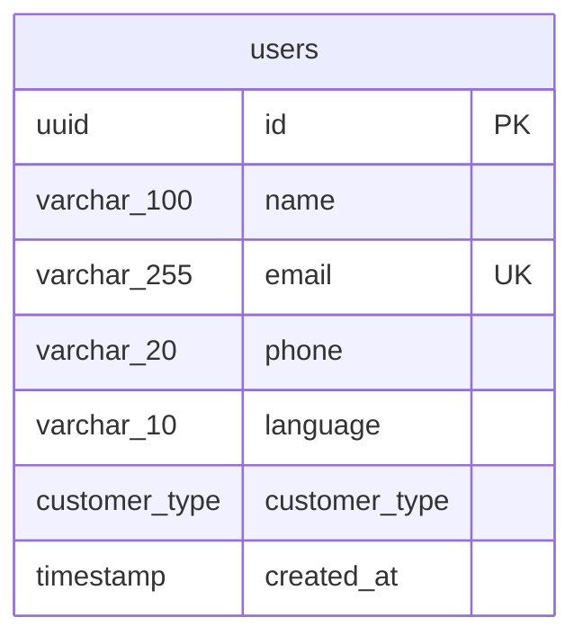

# Epic 1.2 — PostgreSQL Schema

**User Story 1.2.1** (partial) · Users table only  
**Stack:** PostgreSQL 16 · SQLAlchemy 2 · Alembic

---

## 1. Scope

This deliverable covers **only the Users table**. Additional tables will be documented and migrated when you share the next requirements.

| Artifact | Path |
|----------|------|
| SQL reference | `backend/db/schema/001_users.sql` |
| SQLAlchemy model | `backend/app/models/user.py` |
| Alembic migration | `backend/alembic/versions/20260602_0001_create_users_table.py` |

---

## 2. Users table definition

| Column | Type | Nullable | Default | Notes |
|--------|------|----------|---------|-------|
| `id` | `UUID` | NO | `gen_random_uuid()` | Primary key |
| `name` | `VARCHAR(100)` | NO | — | Display name |
| `email` | `VARCHAR(255)` | NO | — | **UNIQUE** |
| `phone` | `VARCHAR(20)` | YES | — | E.164 international |
| `language` | `VARCHAR(10)` | NO | `'en'` | ISO 639-1 style code |
| `customer_type` | `ENUM` | NO | `'regular'` | `regular`, `premium`, `vip` |
| `created_at` | `TIMESTAMP` | NO | `CURRENT_TIMESTAMP` | No time zone (per spec) |

### 2.1 Enum: `customer_type`

```sql
CREATE TYPE customer_type AS ENUM ('regular', 'premium', 'vip');
```

| Value | Typical use |
|-------|----------------|
| `regular` | Standard support tier |
| `premium` | Priority routing / SLA |
| `vip` | Highest priority, dedicated handling |

---

## 3. Indexes

| Index name | Column(s) | Purpose |
|------------|-----------|---------|
| `uq_users_email` | `email` | Uniqueness + lookup (unique constraint) |
| `ix_users_email` | `email` | Fast login / lookup by email |
| `ix_users_phone` | `phone` | Lookup by phone (support identification) |
| `ix_users_customer_type` | `customer_type` | Filter VIP/premium queues |

> `email` has both UNIQUE and `ix_users_email` per story requirements; PostgreSQL may use the unique index for email queries in practice.

---

## 4. Constraints

### 4.1 Email format (`ck_users_email_format`)

PostgreSQL `CHECK` with case-insensitive regex:

```regex
^[A-Za-z0-9._%+-]+@[A-Za-z0-9.-]+\.[A-Za-z]{2,}$
```

**Valid:** `user@example.com`, `name+tag@company.co.uk`  
**Invalid:** `not-an-email`, `@missing.com`, `user@`

### 4.2 Phone format — international / per country (`ck_users_phone_e164`)

Uses **E.164** so one rule covers all countries (no separate column per country):

```regex
^\+[1-9][0-9]{1,14}$
```

| Country | Example | Stored value |
|---------|---------|--------------|
| USA | +1 415 555 2671 | `+14155552671` |
| India | +91 98765 43210 | `+919876543210` |
| UK | +44 20 7946 0958 | `+442079460958` |

- `phone` may be **NULL** (email-only accounts).
- Max length 16 characters in E.164 (`+` + 15 digits); fits `VARCHAR(20)`.

---

## 5. Entity diagram (Users only)



---

## 6. Apply schema locally

```bash
# From repo root
docker compose up -d

cd backend
.venv\Scripts\activate
pip install -r requirements.txt
alembic upgrade head
```

Verify:

```sql
\d users
SELECT enum_range(NULL::customer_type);
```

---

## 7. Acceptance checklist (Users table)

| Requirement | Status |
|-------------|--------|
| `id` UUID | ✅ |
| `name` VARCHAR(100) | ✅ |
| `email` VARCHAR(255) UNIQUE | ✅ |
| `phone` VARCHAR(20) | ✅ |
| `language` VARCHAR(10) DEFAULT `'en'` | ✅ |
| `customer_type` ENUM | ✅ |
| `created_at` TIMESTAMP | ✅ |
| Index on `email` | ✅ |
| Index on `phone` | ✅ |
| Index on `customer_type` | ✅ |
| Email format validation | ✅ |
| Phone format (international / per country via E.164) | ✅ |

---

*Next: share the second table requirement to extend this document and add migration `20260602_0002_*`.*
