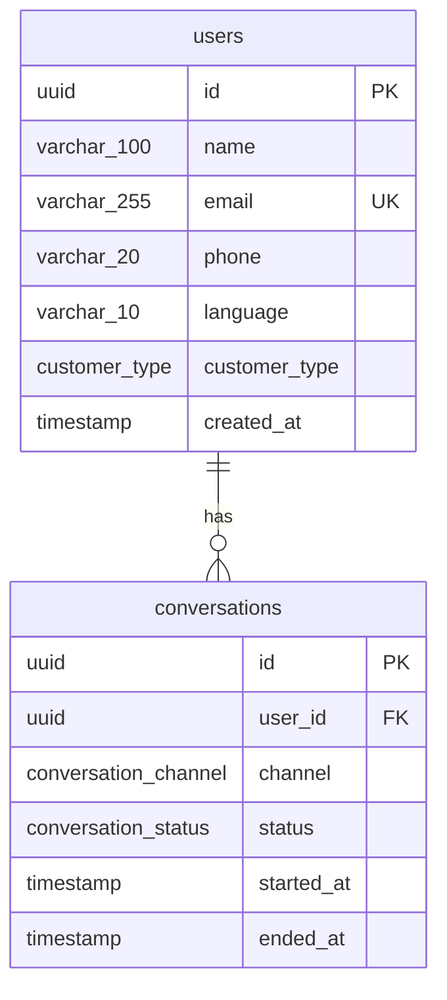

# Epic 1.2 — PostgreSQL Schema

**User Story 1.2.1** (partial) · Users + Conversations tables  
**Stack:** PostgreSQL 16 · SQLAlchemy 2 · Alembic

---

## 1. Scope

| Table | Status |
|-------|--------|
| `users` | ✅ Complete |
| `conversations` | ✅ Complete |
| Additional tables | Pending next requirements |

| Artifact | Path |
|----------|------|
| SQL — users | `backend/db/schema/001_users.sql` |
| SQL — conversations | `backend/db/schema/002_conversations.sql` |
| Models | `backend/app/models/user.py`, `conversation.py` |
| Migrations | `20260602_0001_*`, `20260602_0002_*` |

---

## 2. Users table definition

| Column | Type | Nullable | Default | Notes |
|--------|------|----------|---------|-------|
| `id` | `UUID` | NO | `gen_random_uuid()` | Primary key |
| `name` | `VARCHAR(100)` | NO | — | Display name |
| `email` | `VARCHAR(255)` | NO | — | **UNIQUE** |
| `phone` | `VARCHAR(20)` | YES | — | E.164 international |
| `language` | `VARCHAR(10)` | NO | `'en'` | ISO 639-1 style code |
| `customer_type` | `ENUM` | NO | `'regular'` | `regular`, `premium`, `vip` |
| `created_at` | `TIMESTAMP` | NO | `CURRENT_TIMESTAMP` | No time zone (per spec) |

### 2.1 Enum: `customer_type`

```sql
CREATE TYPE customer_type AS ENUM ('regular', 'premium', 'vip');
```

| Value | Typical use |
|-------|----------------|
| `regular` | Standard support tier |
| `premium` | Priority routing / SLA |
| `vip` | Highest priority, dedicated handling |

---

## 3. Indexes

| Index name | Column(s) | Purpose |
|------------|-----------|---------|
| `uq_users_email` | `email` | Uniqueness + lookup (unique constraint) |
| `ix_users_email` | `email` | Fast login / lookup by email |
| `ix_users_phone` | `phone` | Lookup by phone (support identification) |
| `ix_users_customer_type` | `customer_type` | Filter VIP/premium queues |

> `email` has both UNIQUE and `ix_users_email` per story requirements; PostgreSQL may use the unique index for email queries in practice.

---

## 4. Constraints

### 4.1 Email format (`ck_users_email_format`)

PostgreSQL `CHECK` with case-insensitive regex:

```regex
^[A-Za-z0-9._%+-]+@[A-Za-z0-9.-]+\.[A-Za-z]{2,}$
```

**Valid:** `user@example.com`, `name+tag@company.co.uk`  
**Invalid:** `not-an-email`, `@missing.com`, `user@`

### 4.2 Phone format — international / per country (`ck_users_phone_e164`)

Uses **E.164** so one rule covers all countries (no separate column per country):

```regex
^\+[1-9][0-9]{1,14}$
```

| Country | Example | Stored value |
|---------|---------|--------------|
| USA | +1 415 555 2671 | `+14155552671` |
| India | +91 98765 43210 | `+919876543210` |
| UK | +44 20 7946 0958 | `+442079460958` |

- `phone` may be **NULL** (email-only accounts).
- Max length 16 characters in E.164 (`+` + 15 digits); fits `VARCHAR(20)`.

---

## 5. Conversations table definition

| Column | Type | Nullable | Default | Notes |
|--------|------|----------|---------|-------|
| `id` | `UUID` | NO | `gen_random_uuid()` | Primary key |
| `user_id` | `UUID` | NO | — | FK → `users.id` **ON DELETE CASCADE** |
| `channel` | `ENUM` | NO | — | `web`, `whatsapp`, `email`, `telegram`, `mobile` |
| `status` | `ENUM` | NO | `'active'` | `active`, `resolved`, `escalated`, `closed` |
| `started_at` | `TIMESTAMP` | NO | `CURRENT_TIMESTAMP` | Session start |
| `ended_at` | `TIMESTAMP` | YES | — | Set when conversation closes |

### 5.1 Enum: `conversation_channel`

```sql
CREATE TYPE conversation_channel AS ENUM (
  'web', 'whatsapp', 'email', 'telegram', 'mobile'
);
```

### 5.2 Enum: `conversation_status`

```sql
CREATE TYPE conversation_status AS ENUM (
  'active', 'resolved', 'escalated', 'closed'
);
```

| Status | Meaning |
|--------|---------|
| `active` | Ongoing AI or agent session |
| `resolved` | Issue solved, no agent needed |
| `escalated` | Handed off to human agent |
| `closed` | Terminal state (archived) |

### 5.3 Foreign key

```sql
FOREIGN KEY (user_id) REFERENCES users (id) ON DELETE CASCADE
```

Deleting a **user** automatically deletes all their **conversations** (and any future child rows that CASCADE from conversations).

### 5.4 Composite index

```sql
CREATE INDEX ix_conversations_user_id_status ON conversations (user_id, status);
```

**Optimized query (active lookup):**

```sql
SELECT id, channel, started_at
FROM conversations
WHERE user_id = $1 AND status = 'active'
ORDER BY started_at DESC
LIMIT 1;
```

PostgreSQL uses `ix_conversations_user_id_status` for `(user_id, status)` filters.

---

## 6. Entity diagram



---

## 7. Apply schema locally

```bash
# From repo root
docker compose up -d

cd backend
.venv\Scripts\activate
pip install -r requirements.txt
alembic upgrade head
```

Verify:

```sql
\d users
\d conversations
SELECT enum_range(NULL::conversation_channel);
```

---

## 8. Acceptance checklist

### Users table

| Requirement | Status |
|-------------|--------|
| `id` UUID | ✅ |
| `name` VARCHAR(100) | ✅ |
| `email` VARCHAR(255) UNIQUE | ✅ |
| `phone` VARCHAR(20) | ✅ |
| `language` VARCHAR(10) DEFAULT `'en'` | ✅ |
| `customer_type` ENUM | ✅ |
| `created_at` TIMESTAMP | ✅ |
| Index on `email` | ✅ |
| Index on `phone` | ✅ |
| Index on `customer_type` | ✅ |
| Email format validation | ✅ |
| Phone format (international / per country via E.164) | ✅ |

### Conversations table

| Requirement | Status |
|-------------|--------|
| `id` UUID | ✅ |
| `user_id` FK → users | ✅ |
| `channel` ENUM (5 values) | ✅ |
| `status` ENUM (4 values) | ✅ |
| `started_at` TIMESTAMP | ✅ |
| `ended_at` TIMESTAMP NULL | ✅ |
| Composite index `(user_id, status)` | ✅ |
| FK `ON DELETE CASCADE` | ✅ |

---

*Next: share the third table requirement for migration `20260602_0003_*`.*
