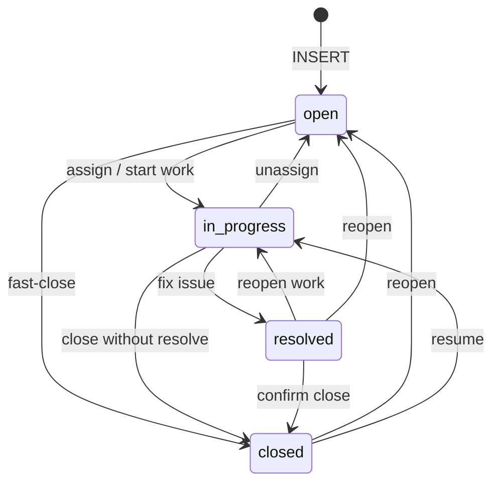
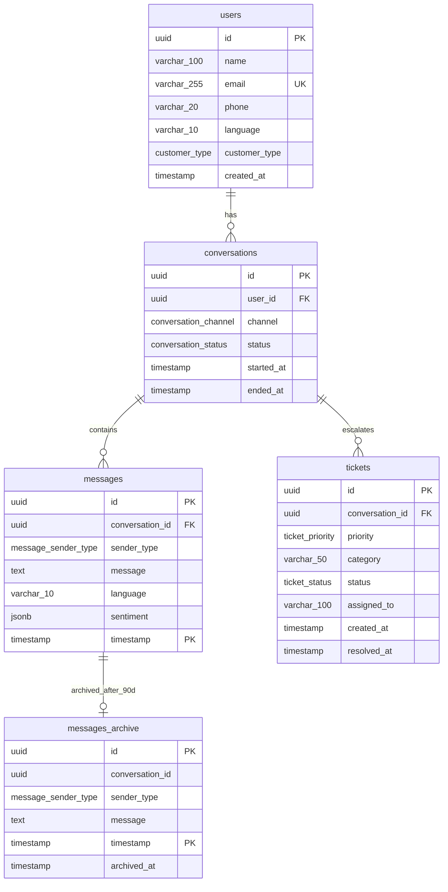

# Epic 1.2 — PostgreSQL Schema

**User Story 1.2.1** (partial) · Users, Conversations, Messages, Tickets  
**Stack:** PostgreSQL 16 · SQLAlchemy 2 · Alembic

---

## 1. Scope

| Table | Status |
|-------|--------|
| `users` | ✅ Complete |
| `conversations` | ✅ Complete |
| `messages` (+ `messages_archive`) | ✅ Complete |
| `tickets` | ✅ Complete |
| Additional tables | Pending next requirements |

| Artifact | Path |
|----------|------|
| SQL — users | `backend/db/schema/001_users.sql` |
| SQL — conversations | `backend/db/schema/002_conversations.sql` |
| SQL — messages | `backend/db/schema/003_messages.sql` |
| SQL — tickets | `backend/db/schema/004_tickets.sql` |
| Models | `user.py`, `conversation.py`, `message.py`, `ticket.py` |
| Migrations | `20260602_0001_*` … `20260602_0004_*` |

---

## 2. Users table definition

| Column | Type | Nullable | Default | Notes |
|--------|------|----------|---------|-------|
| `id` | `UUID` | NO | `gen_random_uuid()` | Primary key |
| `name` | `VARCHAR(100)` | NO | — | Display name |
| `email` | `VARCHAR(255)` | NO | — | **UNIQUE** |
| `phone` | `VARCHAR(20)` | YES | — | E.164 international |
| `language` | `VARCHAR(10)` | NO | `'en'` | ISO 639-1 style code |
| `customer_type` | `ENUM` | NO | `'regular'` | `regular`, `premium`, `vip` |
| `created_at` | `TIMESTAMP` | NO | `CURRENT_TIMESTAMP` | No time zone (per spec) |

### 2.1 Enum: `customer_type`

```sql
CREATE TYPE customer_type AS ENUM ('regular', 'premium', 'vip');
```

| Value | Typical use |
|-------|----------------|
| `regular` | Standard support tier |
| `premium` | Priority routing / SLA |
| `vip` | Highest priority, dedicated handling |

---

## 3. Indexes

| Index name | Column(s) | Purpose |
|------------|-----------|---------|
| `uq_users_email` | `email` | Uniqueness + lookup (unique constraint) |
| `ix_users_email` | `email` | Fast login / lookup by email |
| `ix_users_phone` | `phone` | Lookup by phone (support identification) |
| `ix_users_customer_type` | `customer_type` | Filter VIP/premium queues |

> `email` has both UNIQUE and `ix_users_email` per story requirements; PostgreSQL may use the unique index for email queries in practice.

---

## 4. Constraints

### 4.1 Email format (`ck_users_email_format`)

PostgreSQL `CHECK` with case-insensitive regex:

```regex
^[A-Za-z0-9._%+-]+@[A-Za-z0-9.-]+\.[A-Za-z]{2,}$
```

**Valid:** `user@example.com`, `name+tag@company.co.uk`  
**Invalid:** `not-an-email`, `@missing.com`, `user@`

### 4.2 Phone format — international / per country (`ck_users_phone_e164`)

Uses **E.164** so one rule covers all countries (no separate column per country):

```regex
^\+[1-9][0-9]{1,14}$
```

| Country | Example | Stored value |
|---------|---------|--------------|
| USA | +1 415 555 2671 | `+14155552671` |
| India | +91 98765 43210 | `+919876543210` |
| UK | +44 20 7946 0958 | `+442079460958` |

- `phone` may be **NULL** (email-only accounts).
- Max length 16 characters in E.164 (`+` + 15 digits); fits `VARCHAR(20)`.

---

## 5. Conversations table definition

| Column | Type | Nullable | Default | Notes |
|--------|------|----------|---------|-------|
| `id` | `UUID` | NO | `gen_random_uuid()` | Primary key |
| `user_id` | `UUID` | NO | — | FK → `users.id` **ON DELETE CASCADE** |
| `channel` | `ENUM` | NO | — | `web`, `whatsapp`, `email`, `telegram`, `mobile` |
| `status` | `ENUM` | NO | `'active'` | `active`, `resolved`, `escalated`, `closed` |
| `started_at` | `TIMESTAMP` | NO | `CURRENT_TIMESTAMP` | Session start |
| `ended_at` | `TIMESTAMP` | YES | — | Set when conversation closes |

### 5.1 Enum: `conversation_channel`

```sql
CREATE TYPE conversation_channel AS ENUM (
  'web', 'whatsapp', 'email', 'telegram', 'mobile'
);
```

### 5.2 Enum: `conversation_status`

```sql
CREATE TYPE conversation_status AS ENUM (
  'active', 'resolved', 'escalated', 'closed'
);
```

| Status | Meaning |
|--------|---------|
| `active` | Ongoing AI or agent session |
| `resolved` | Issue solved, no agent needed |
| `escalated` | Handed off to human agent |
| `closed` | Terminal state (archived) |

### 5.3 Foreign key

```sql
FOREIGN KEY (user_id) REFERENCES users (id) ON DELETE CASCADE
```

Deleting a **user** automatically deletes all their **conversations** (and any future child rows that CASCADE from conversations).

### 5.4 Composite index

```sql
CREATE INDEX ix_conversations_user_id_status ON conversations (user_id, status);
```

**Optimized query (active lookup):**

```sql
SELECT id, channel, started_at
FROM conversations
WHERE user_id = $1 AND status = 'active'
ORDER BY started_at DESC
LIMIT 1;
```

PostgreSQL uses `ix_conversations_user_id_status` for `(user_id, status)` filters.

---

## 6. Messages table definition

| Column | Type | Nullable | Default | Notes |
|--------|------|----------|---------|-------|
| `id` | `UUID` | NO | `gen_random_uuid()` | Part of composite PK |
| `conversation_id` | `UUID` | NO | — | FK → `conversations.id` **ON DELETE CASCADE** |
| `sender_type` | `ENUM` | NO | — | `customer`, `ai`, `human_agent` |
| `message` | `TEXT` | NO | — | Full message body |
| `language` | `VARCHAR(10)` | NO | `'en'` | Message language |
| `sentiment` | `JSONB` | YES | — | e.g. `{"score": 0.82, "label": "positive"}` |
| `timestamp` | `TIMESTAMP` | NO | `CURRENT_TIMESTAMP` | Partition key + part of PK |

> **Composite PK `(id, timestamp)`:** PostgreSQL requires the partition key in every unique constraint. `id` remains a UUID and is globally unique in practice.

### 6.1 Enum: `message_sender_type`

```sql
CREATE TYPE message_sender_type AS ENUM ('customer', 'ai', 'human_agent');
```

### 6.2 Full-text search index

```sql
CREATE INDEX ix_messages_message_fts
    ON messages USING GIN (to_tsvector('english', message));
```

**Search example:**

```sql
SELECT id, conversation_id, message, "timestamp"
FROM messages
WHERE to_tsvector('english', message) @@ plainto_tsquery('english', 'refund order')
ORDER BY "timestamp" DESC
LIMIT 20;
```

The same GIN index exists on `messages_archive` for historical search.

### 6.3 Monthly partition strategy

Parent table partitioned by **RANGE** on `"timestamp"`:

```sql
CREATE TABLE messages ( ... ) PARTITION BY RANGE ("timestamp");
```

Child partitions: `messages_y2026m06`, `messages_y2026m07`, …

| Function | Purpose |
|----------|---------|
| `create_messages_partition(year, month)` | Create one monthly partition if missing |
| `ensure_messages_partitions(months_ahead)` | Bootstrap current month + N future months |

**Run monthly (cron / pg_cron):**

```sql
SELECT ensure_messages_partitions(3);  -- keep 3 months ahead provisioned
```

**Benefits:**
- Queries with `timestamp` range scan only relevant partitions (partition pruning)
- Old months can be detached/dropped after archive without full-table locks
- Smaller indexes per month → faster FTS and inserts

### 6.4 Archiving policy (90 days)

| Tier | Table | Retention | Action |
|------|-------|-----------|--------|
| **Hot** | `messages` (partitions) | **≤ 90 days** | Active reads/writes |
| **Cold** | `messages_archive` | Long-term | Rows moved after 90 days |

**Archive function:**

```sql
SELECT archive_messages_older_than(90);  -- returns count of rows moved
```

**What it does:**
1. `DELETE FROM messages WHERE timestamp < now() - 90 days`
2. `INSERT` deleted rows into `messages_archive` (adds `archived_at`)
3. Returns number of archived rows

**Schedule (recommended daily, off-peak):**

```sql
-- pg_cron example
SELECT cron.schedule('archive-messages', '0 3 * * *',
    $$SELECT archive_messages_older_than(90)$$);
```

Or from application/worker cron calling the same SQL.

**Policy summary:**

| Age | Location | Query target |
|-----|----------|--------------|
| 0–90 days | `messages` | Real-time chat, FTS |
| 90+ days | `messages_archive` | Compliance, analytics, audit |

---

## 7. Tickets table definition

| Column | Type | Nullable | Default | Notes |
|--------|------|----------|---------|-------|
| `id` | `UUID` | NO | `gen_random_uuid()` | Primary key |
| `conversation_id` | `UUID` | NO | — | FK → `conversations.id` **ON DELETE CASCADE** |
| `priority` | `ENUM` | NO | `'medium'` | `low`, `medium`, `high`, `urgent` |
| `category` | `VARCHAR(50)` | NO | — | e.g. `billing`, `technical` |
| `status` | `ENUM` | NO | `'open'` | `open`, `in_progress`, `resolved`, `closed` |
| `assigned_to` | `VARCHAR(100)` | YES | — | Agent id or name |
| `created_at` | `TIMESTAMP` | NO | `CURRENT_TIMESTAMP` | Ticket opened |
| `resolved_at` | `TIMESTAMP` | YES | — | Set when resolved/closed |

### 7.1 Indexes

| Index | Column(s) | Purpose |
|-------|-----------|---------|
| `ix_tickets_priority` | `priority` | Queue by urgency |
| `ix_tickets_status` | `status` | Filter open / in-progress boards |
| `ix_tickets_assigned_to` | `assigned_to` | Agent workload lookup |

### 7.2 Automatic status transition rules

Enforced by trigger `trg_tickets_status_rules` → function `enforce_ticket_status_rules()`.

#### Allowed transitions

| From → To | `open` | `in_progress` | `resolved` | `closed` |
|-----------|:------:|:-------------:|:----------:|:--------:|
| **open** | — | ✅ | — | ✅ |
| **in_progress** | ✅ | — | ✅ | ✅ |
| **resolved** | ✅ | ✅ | — | ✅ |
| **closed** | ✅ | ✅ | — | — |

Invalid transitions raise: `Invalid ticket status transition: <old> -> <new>`.

#### Automatic field updates

| Rule | Behavior |
|------|----------|
| **New ticket** | Must start as `open`; `resolved_at = NULL` |
| **→ resolved / closed** | Sets `resolved_at = CURRENT_TIMESTAMP` if not already set |
| **→ open / in_progress** | Clears `resolved_at = NULL` (reopen) |
| **CHECK constraint** | `resolved_at` required when status is `resolved` or `closed`; must be NULL when `open` or `in_progress` |



**Example — assign and resolve:**

```sql
INSERT INTO tickets (conversation_id, category)
VALUES ('...', 'billing');  -- status defaults to open

UPDATE tickets SET status = 'in_progress', assigned_to = 'agent_42' WHERE id = '...';
UPDATE tickets SET status = 'resolved' WHERE id = '...';
-- resolved_at set automatically
```

---

## 8. Entity diagram



---

## 9. Apply schema locally

```bash
# From repo root
docker compose up -d

cd backend
.venv\Scripts\activate
pip install -r requirements.txt
alembic upgrade head
```

Verify:

```sql
\d users
\d conversations
\d messages
\d messages_archive
SELECT tablename FROM pg_tables WHERE tablename LIKE 'messages_y%';
SELECT enum_range(NULL::message_sender_type);
\d tickets
SELECT enum_range(NULL::ticket_status);
```

---

## 10. Acceptance checklist

### Users table

| Requirement | Status |
|-------------|--------|
| `id` UUID | ✅ |
| `name` VARCHAR(100) | ✅ |
| `email` VARCHAR(255) UNIQUE | ✅ |
| `phone` VARCHAR(20) | ✅ |
| `language` VARCHAR(10) DEFAULT `'en'` | ✅ |
| `customer_type` ENUM | ✅ |
| `created_at` TIMESTAMP | ✅ |
| Index on `email` | ✅ |
| Index on `phone` | ✅ |
| Index on `customer_type` | ✅ |
| Email format validation | ✅ |
| Phone format (international / per country via E.164) | ✅ |

### Conversations table

| Requirement | Status |
|-------------|--------|
| `id` UUID | ✅ |
| `user_id` FK → users | ✅ |
| `channel` ENUM (5 values) | ✅ |
| `status` ENUM (4 values) | ✅ |
| `started_at` TIMESTAMP | ✅ |
| `ended_at` TIMESTAMP NULL | ✅ |
| Composite index `(user_id, status)` | ✅ |
| FK `ON DELETE CASCADE` | ✅ |

### Messages table

| Requirement | Status |
|-------------|--------|
| `id` UUID | ✅ |
| `conversation_id` FK | ✅ |
| `sender_type` ENUM (3 values) | ✅ |
| `message` TEXT | ✅ |
| `language` VARCHAR(10) | ✅ |
| `sentiment` JSONB | ✅ |
| `timestamp` TIMESTAMP | ✅ |
| Full-text search index on `message` | ✅ |
| Partition by month | ✅ |
| Archiving policy > 90 days | ✅ |

### Tickets table

| Requirement | Status |
|-------------|--------|
| `id` UUID | ✅ |
| `conversation_id` FK | ✅ |
| `priority` ENUM (4 values) | ✅ |
| `category` VARCHAR(50) | ✅ |
| `status` ENUM (4 values) | ✅ |
| `assigned_to` VARCHAR(100) | ✅ |
| `created_at` TIMESTAMP | ✅ |
| `resolved_at` TIMESTAMP NULL | ✅ |
| Index on `priority` | ✅ |
| Index on `status` | ✅ |
| Index on `assigned_to` | ✅ |
| Automatic status transition rules | ✅ |

---

---

## Related documents

- [EPIC_1.2_MIGRATIONS_AND_BACKUP.md](./EPIC_1.2_MIGRATIONS_AND_BACKUP.md) — User Story 1.2.2 (Alembic, backups, PITR, replica)

---

*Next: share additional table requirements for migration `20260602_0005_*` if any.*
