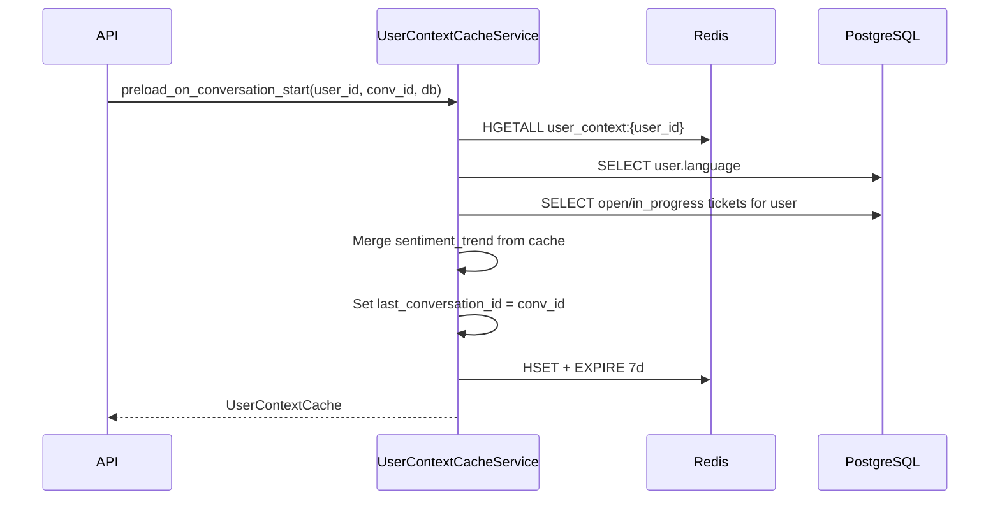

# Epic 1.3 — Redis User Context

**User Story 1.3.1** (user context) · AI Customer Support System

---

## 1. Scope

| Task | Status |
|------|--------|
| Redis HASH `user_context:{user_id}` | ✅ |
| Fields: language, last conversation, sentiment, tickets | ✅ |
| TTL 7 days (returning users) | ✅ |
| Preload on conversation start | ✅ |

---

## 2. Redis structure

**Type:** `HASH`  
**Key:** `user_context:{user_id}`  
**Database:** Redis **DB 0** (with sessions)

| Hash field | Type | Example |
|------------|------|---------|
| `preferred_language` | string | `en` |
| `last_conversation_id` | string (UUID) | `7c9e6679-...` |
| `sentiment_trend` | JSON array | `[{"label":"positive","score":0.82}]` |
| `active_ticket_ids` | JSON array | `["uuid1","uuid2"]` |

---

## 3. TTL — 7 days

| Setting | Value |
|---------|-------|
| `REDIS_USER_CONTEXT_TTL_SECONDS` | `604800` (7 × 24 × 3600) |

TTL refreshed on every `save()` and `preload_on_conversation_start()`.

---

## 4. Preload on conversation start

**Method:** `UserContextCacheService.preload_on_conversation_start(user_id, conversation_id, db)`

**Flow:**



| Source | Data |
|--------|------|
| PostgreSQL `users` | `preferred_language` |
| PostgreSQL `tickets` + `conversations` | `active_ticket_ids` (open / in_progress) |
| Redis cache (if exists) | `sentiment_trend` preserved |
| Conversation start | `last_conversation_id` updated |

---

## 5. Service API

**File:** `backend/app/services/user_context_cache.py`

| Method | Description |
|--------|-------------|
| `get(user_id)` | Read HASH |
| `save(context)` | Write HASH + refresh TTL |
| `preload_on_conversation_start(...)` | DB load + cache write |
| `delete(user_id)` | Remove context |

**Usage:**

```python
from uuid import UUID
from app.core.database import AsyncSessionLocal
from app.services.user_context_cache import UserContextCacheService

service = UserContextCacheService()
async with AsyncSessionLocal() as db:
    context = await service.preload_on_conversation_start(
        user_id=UUID("..."),
        conversation_id=UUID("..."),
        db=db,
    )
```

---

## 6. Verify

```bash
docker exec ai_support_redis redis-cli -n 0 HGETALL user_context:<user_id>
docker exec ai_support_redis redis-cli -n 0 TTL user_context:<user_id>
```

Expected TTL ≤ `604800`.

---

## 7. Acceptance checklist

| Requirement | Done |
|-------------|------|
| HASH `user_context:{user_id}` | ✅ |
| preferred_language | ✅ |
| last_conversation_id | ✅ |
| sentiment_trend | ✅ |
| active_ticket_ids | ✅ |
| TTL 7 days | ✅ |
| Preload on conversation start | ✅ |
